# Architecture Diagram Generation Prompts

## Prompt 1: System Architecture (Recommended for README)

```
Create a professional system architecture diagram for AGI-Sentinel, a multi-agent pharmacovigilance system.

Components to include:

1. USER INTERFACE (top)
   - Web Browser
   - REST API

2. ORCHESTRATOR (center)
   - Coordinates all agents
   - Manages pipeline flow

3. FOUR AGENTS (arranged in sequence):
   
   A. MemoryAgent (left)
      - Icon: Brain/memory symbol
      - Functions: Retrieve past insights, Store new learnings
      - Connected to: SQLite Database
   
   B. IngestAgent (second)
      - Icon: Download/import symbol
      - Functions: Fetch FDA data, Store reports
      - Connected to: OpenFDA API, SQLite Database
   
   C. AnalyzerAgent (third)
      - Icon: Chart/analytics symbol
      - Functions: Compute statistics, Detect signals
      - Connected to: SQLite Database
   
   D. ExplainAgent (right)
      - Icon: Document/report symbol
      - Functions: Generate LLM analysis, Extract insights
      - Connected to: Google Gemini API

4. DATA STORES (bottom):
   - SQLite Database (adverse_events table, memories table)
   - Report Files (Markdown)

5. EXTERNAL SERVICES (sides):
   - OpenFDA API (left side)
   - Google Gemini 2.0 API (right side)

DATA FLOW:
- Show arrows indicating: User → Orchestrator → Memory → Ingest → Analyze → Explain → Memory (loop)
- Highlight the learning loop from ExplainAgent back to MemoryAgent

STYLE:
- Modern, clean design
- Use blue/purple gradient colors for agents
- Green for external APIs
- Gray for databases
- Include icons for each component
- Show bidirectional arrows where appropriate
- Add labels on arrows (e.g., "Fetch reports", "Store insights", "Generate analysis")
```

---

## Prompt 2: Data Flow Diagram (Alternative)

```
Create a data flow diagram showing how information moves through AGI-Sentinel:

SEQUENCE:
1. User submits drug name + limit
2. MemoryAgent retrieves historical insights
3. IngestAgent fetches adverse events from OpenFDA
4. IngestAgent stores events in SQLite
5. AnalyzerAgent loads events from database
6. AnalyzerAgent computes statistics and detects signals
7. ExplainAgent receives signals
8. ExplainAgent calls Gemini API for analysis
9. ExplainAgent generates markdown report
10. MemoryAgent extracts insights from analysis
11. MemoryAgent stores insights in database
12. Report returned to user

STYLE:
- Swimlane diagram with 4 lanes (one per agent)
- Show data objects as rectangles
- Show processes as rounded rectangles
- Use arrows to show data movement
- Highlight LLM calls in orange
- Highlight database operations in blue
- Show the memory feedback loop clearly
```

---

## Prompt 3: Agent Interaction Diagram (Detailed)

```
Create a detailed agent interaction diagram for AGI-Sentinel showing:

AGENTS (as nodes):
1. MemoryAgent
   - Methods: retrieve_relevant(), store_insight(), extract_insights_from_analysis()
   
2. IngestAgent
   - Methods: ingest(drug, limit)
   
3. AnalyzerAgent
   - Methods: analyze(drug)
   
4. ExplainAgent
   - Methods: explain(drug, analysis_info)

INTERACTIONS (as arrows):
- Orchestrator → MemoryAgent: "Get past insights for {drug}"
- MemoryAgent → Orchestrator: "Returns List[Memory]"
- Orchestrator → IngestAgent: "Fetch {limit} reports for {drug}"
- IngestAgent → OpenFDA: "API call"
- IngestAgent → Database: "Store events"
- Orchestrator → AnalyzerAgent: "Analyze {drug}"
- AnalyzerAgent → Database: "Load events"
- AnalyzerAgent → Orchestrator: "Returns signals"
- Orchestrator → ExplainAgent: "Generate report"
- ExplainAgent → Gemini: "LLM call with context"
- ExplainAgent → Orchestrator: "Returns analysis text"
- Orchestrator → MemoryAgent: "Extract & store insights"
- MemoryAgent → Gemini: "LLM call for insight extraction"
- MemoryAgent → Database: "Store insights"

STYLE:
- UML sequence diagram format
- Show lifelines for each agent
- Include activation boxes
- Label all messages
- Highlight LLM calls
- Show database transactions
```

---

## Recommended Tool

Use one of these tools to generate the diagram:

1. **Mermaid Live Editor** (https://mermaid.live/)
   - Free, web-based
   - Supports flowcharts, sequence diagrams
   - Can export as PNG/SVG

2. **Excalidraw** (https://excalidraw.com/)
   - Hand-drawn style
   - Very visual and modern
   - Easy to use

3. **Draw.io** (https://app.diagrams.net/)
   - Professional diagrams
   - Many templates
   - Export to multiple formats

4. **Lucidchart** (https://www.lucidchart.com/)
   - Professional tool
   - Great templates
   - Free tier available

---

## Quick Mermaid Code (Copy-Paste Ready)

```mermaid
graph TB
    User[👤 User<br/>Web Interface]
    Orch[🎭 Orchestrator<br/>Pipeline Coordinator]
    
    Mem[🧠 MemoryAgent<br/>• Retrieve insights<br/>• Store learnings]
    Ing[📥 IngestAgent<br/>• Fetch FDA data<br/>• Store reports]
    Ana[📊 AnalyzerAgent<br/>• Detect signals<br/>• Compute stats]
    Exp[📝 ExplainAgent<br/>• Generate report<br/>• Extract insights]
    
    FDA[🌐 OpenFDA API]
    Gem[🤖 Gemini 2.0 API]
    DB[(💾 SQLite<br/>• Events<br/>• Memories)]
    
    User -->|Request| Orch
    Orch -->|1. Get history| Mem
    Mem -.->|Past insights| Orch
    Orch -->|2. Fetch data| Ing
    Ing -->|API call| FDA
    Ing -->|Store| DB
    Orch -->|3. Analyze| Ana
    Ana -->|Load| DB
    Ana -.->|Signals| Orch
    Orch -->|4. Explain| Exp
    Exp -->|LLM call| Gem
    Exp -.->|Analysis| Orch
    Orch -->|5. Store insights| Mem
    Mem -->|LLM call| Gem
    Mem -->|Save| DB
    Orch -.->|Report| User
    
    Mem -.->|Learning Loop| Mem
    
    style Mem fill:#e1bee7
    style Ing fill:#bbdefb
    style Ana fill:#c5e1a5
    style Exp fill:#ffccbc
    style Gem fill:#fff9c4
    style FDA fill:#b2dfdb
    style DB fill:#cfd8dc
```



Paste this into https://mermaid.live/ to generate the diagram!
